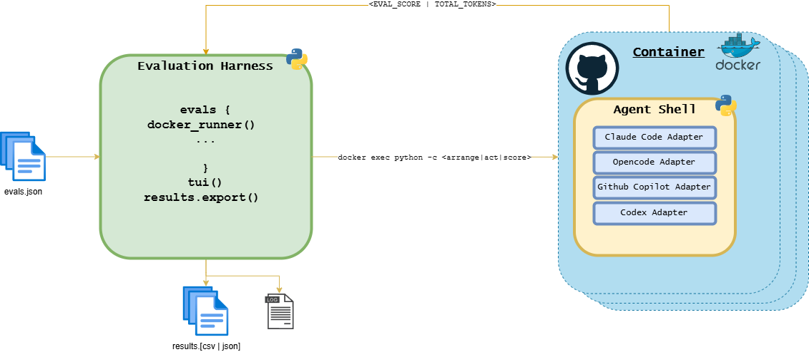

This evaluation harness is designed to test not just Large Language Models but also the Agentic Coding
harnesses that are wrapped around these models. 

I feel it is important to frame all evaluations from the perpsective of not just the Large Language Model
but also the coding harness that was used during the evaluation.

The following agent harnesses are currently supported: 

- [x] Claude Code
- [x] Opencode
- [x] Copilot
- [x] Codex
- [ ] Pi

A lot of this is possible thanks to the agentic harness abstraction repository 
[agent-shell](https://github.com/ScottRBK/agent-shell), check it out if you have use cases where you 
want to seemlessly switch between agentic harness for a particular worklow that you invoke via code 
or scripts. It was originally inspired for auto-research type loops but I've come to find many an 
application for it.

## Example Eval Patterns
This harness ships with some example evals, as I come up with different types of 
evaluations for my own workflows, then this example collection will increase.

These evals are to some degree quite straight forward for modern harnesses and models, given that they 
use public repos or present well known solved challenges that are likely in training data. That is fine 
however as their primary function is to demonstrate the different evaluation patterns. Below is a 
list of the patterns and a brief description:

|Evaluation Pattern|Description|Example Evaluation|
|------------------|-----------|------------------|
|[Search with Questions and Answers](docs/eval_patterns/search_with_qa.md)|Have an agent perform a search of a knowedge base and then answer multiple choice questions about it in a JSON file, this eval also demonstrates how you can add an mcp server to the agentic harness as part of the evaluation|encode_repo_forgetful|
|[Bug Fix with Automated Tests](docs/eval_patterns/bug_fix.md)|Ask the agent to fix bugs in a repo that is causing automated tests to fail, this eval also demonstrates how to restore the original tests to ensure agent hasn't modified them to pass|inflection_bug_fix|
|[Schema Field Mapping](docs/eval_patterns/schema_field_mapping.md)|Instructs the agent to create a field mapping between two data models and output the values to a CSV file for scoring, an alternative to the JSON question and answers|saleor_spree_mapping|
|[New Feature with Automated Tests](docs/eval_patterns/new_feature.md)|Ask an agent to implement a new feature with prediefined API contract and run hidden automated tests after the agent has completed their work, it also demonstrates how you can make use of extrending the base docker image, in this example we add rustup to allow for the agent to use cargo to build and test in Rust|chess_engine|
|[Test Authoring](docs/eval_patterns/test_authoring.md)|The inverse of the Bug Fix pattern: hand the agent the code with its test suite deleted and ask it to write one, then grade the suite by mutation testing - the harness applies small behavioural faults to the module and scores the fraction the agent's tests catch|inflection_test_writing|
|[Scorer Authoring](docs/eval_patterns/eval_generator.md)|Ask an agent to write a scoring routine that discriminates a correct implementation of a small task from incorrect ones, without ever seeing the held-out solutions|eval_generator|

# Getting Started

install uv if you do not have it already:
```bash
curl -LsSf https://astral.sh/uv/install.sh | sh
```

1. Fork the repo 
1. run `uv sync` 
1. Replace the example eval folder with your own evals (or leave it in place if you want to see an example)
1. Update evals.json 
1. build the container(s)
```bash
docker build -t eval-harness:latest -f src/docker/Dockerfile src/docker/
docker build -t eval-harness-rust:latest -f src/docker/rust/Dockerfile src/docker/
```
1. execute the harness 
```bash 
uv run main.py
```
> [!TIP]
> If you would like to use an AI Agent to help you build evals it is recommended you install the 
> [skills](skills/) that accompany this repository.

## [Configration](docs/config.md)

# Harness Architecture



The harness is structured in a way that there is an [evaluation protocol](src/evaluation_file_protocol.py), 
any evaluation must implement the same methods within the protocol.

When the harness is run it ingests an evaluation configuration file (the default is [evals.json](evals.json)), which determines
which evaluations are in scope of the evaluation run, and also which agent harness/model combinations
should be in scope of the run.

When I build my own automated tests for testing my actual code, I have used the popular _Arrange_, 
_Act_ and _Assert_ pattern, to this end I have adopted these as methods that any evaluation class must
provide, with one exception, given that `assert` is a keyword in python, I changed that to `score`.

## The Anatomy of an Eval
Each evaluation is it's own folder containing the python logic and any test fixtures that are required
as part of the evaluation itself. Eval folders live under one of the roots listed in the
`EVALS_DIRS` setting (an os.pathsep-separated list searched in order, default `example_evals`),
so your own evals can live in a completely separate directory or repo — point
`EVAL_HARNESS_EVALS_DIRS` at it and the first root containing a requested eval wins.

Each eval folder must contain an `eval.py` implementing the protocol specified in
[/src/evaluation_file_protocol.py], with a class name that matches the eval directory name
converted from snake case (`encode_repo_forgetful`) to pascal case (`EncodeRepoForgetful`).
The harness loads `eval.py` directly by file path, so no `__init__.py` is required.

For each phase (`assert`, `act` and `score`) the harness will extract the python script from the evaluation
classes methods using the `method_to_script` function 

***Hey Listen*** It is important to note that during execution the logic for each stage is extracted into
a string and injected into a `python -c` command, which means any dependencies for each phase must be 
lazy loaded into the phases method itself. 

```python
    async def arrange(self) -> None:
        import os 
        import subprocess
        import time
        from agent_shell.shell import AgentShell 
        from agent_shell.models.agent import AgentType, MCPServerSpec, MCPServerType
```

### Embedded Values 
As well as scrapping the method it will also scrape any embedded values that need to injected into the 
script at run time, such as for example a prompt file held within the `fixtures` directory of the 
evaluation. These can then be referenced as variables inside of your actual methods. 

To use embedded values you need to instantiate these at the top of the evaluation class file and then
inside of the class themselves set their values inside the appropriate phase embedde values dictionary:

```python 
ENCODING_PROMPT = ""
REPO_URL = ""
REPO_REF = ""
REPO_DIR = ""
QUESTIONS= ""
ANSWERS = ""

class EncodeRepoForgetful:

    arrange_embedded_values = {
        "REPO_URL": "https://github.com/fastapi/typer",
        "REPO_REF": "0.26.7",
        "REPO_DIR": "/workspace/typer",
        "ENCODING_PROMPT": read_eval_fixture(__file__, "encoding_prompt.md"),
    }
    act_embedded_values = {
        "QUESTIONS":  read_questions(__file__, False)
    }
    score_embedded_values = {
        "ANSWERS": read_questions(__file__, True)
    }
...

```

These can then be referenced inside of the methods as normal variables:
```python
    async def act(self) -> None:
        import os
        import json 
        from agent_shell.shell import AgentShell
        from agent_shell.models.agent import AgentType

        scaffold = json.loads(QUESTIONS)
```

### Arrange 
The purpose of the arrange phase is to setup the evaluation. For example if you are looking to bring in 
any repositories to the container or preparing any agent harness specifics such as setting up and
configuring an MCP server.

### Act 
The act phase is where you will ask the agnet to perform the action that you will want to measure in the
score phase. Such as fixing a bug or implementing a feature. 

### Score 
In this phase you will validate the outcome of the act phase, such as executing automated tests or scoring
answers to a series of questions. 

### Output and Logging
Each session gets it's own directory created under the location of the `EVAL_HARNESS_OUTPUT_DIR`, which
defaults to `output` in the root of the solution. 

Each agent gets their own .log file, which amongst other things, captures all print captured in the eval 
scripts. 

As well as this a .log file for each agent there is also a results file that is created based on your
[configuration](docs/config.md). 

The results file is written as either `results.json` (the default) or `results.csv`. See
[Results File Schema](docs/results.md) for the full field-by-field breakdown.


# Road Map
- finish roadmap
- CI/CD
- extend support to pi coding agent harness
- extend tui functionality (view results in tui)
- polish console output
- add direct api key authorisation for harnes


# Technical Notes

### Building behind a TLS-intercepting proxy

If your machine routes traffic through a TLS-intercepting proxy (Netskope, Zscaler, etc.), container builds 
and agent API calls will fail certificate verification. Drop your proxy's CA certificate chain 
(PEM format, `.crt` extension) into `src/docker/certs/` and rebuild — certs in that directory are gitignored and get baked into the image's trust store. To extract the chain your proxy presents:

```bash
docker run --rm node:24 sh -c 'echo | openssl s_client -showcerts -connect astral.sh:443 2>/dev/null' \
  | awk '/BEGIN CERTIFICATE/{n++} n>=2' > src/docker/certs/proxy-ca.crt
```
